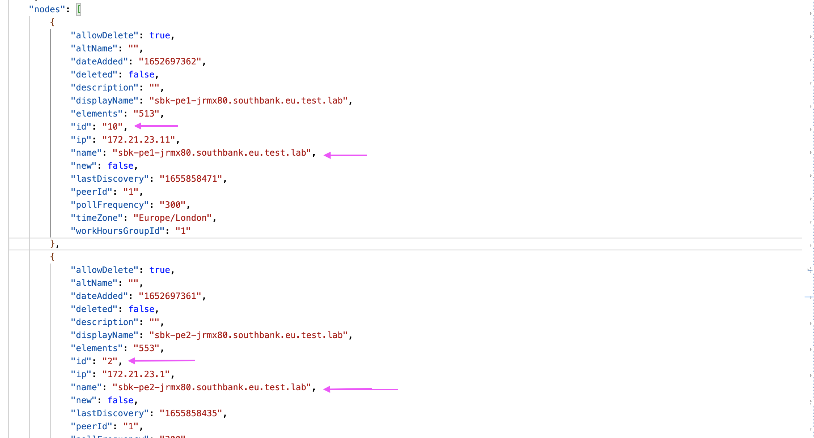

# Creating IBM SevOne Topology in IBM Watson AIOps 3.5

IBM SevOne NPM alerts or events could be configured to send to Watson AIOps to leverage AI-capabilities to pull and analyze data from multiple IT platforms to help with ITOps management. 

In addition to events, the topology found in the SevOne may also be copied to Watson AIOps for better correlation and graphical representation of the events.  This document explains how to copy the SevOne topology into Watson AIOps v3.5. The out of the box Topology observer for SevOne should be available soon in the Watson AI-Ops, until then the script would be helfpul.

The script is available in [scripts](./scripts) folder.


## 1. Create File Observer Job in Watson AIOps

Create File Observer Job in Watson AIOps to observe the topology from the File. 

Sample data is given as screenshot.


The detailed explanation about how to create File Observer Job is explained here https://github.com/GandhiCloudLab/ibm-watson-aiops/tree/main/07-topology-fileobserver

## 2. Retrieve File Observer Access Details

Need to retrieve the file observer API urls, user and pwd details using the below steps.

#### 2.1. Login to OCP Cluster

Login to OCP cluster where WAIOps is installed using  `oc login` command .

#### 2.2. Run the print script

Run the below script.

```
cd scripts/sh
sh 10-print-waiops-topo-access.sh
```
Here could be the output. We can use these values later.
 
```
=====================================================================================================
WAIOPS_TOPO_URL = "https://aaaa/1.0/file-observer/files"
WAIOPS_TOPO_USER = "aiops-topology-cp4waiops-user"
WAIOPS_TOPO_PWD = "bbbbb"
WAIOPS_TOPO_TENENT_ID = "cccc"
=====================================================================================================
```

## 3. Update Properties

The property file 00-config.sh to be updated with the below details.

The property file is available in [scripts/run/00-config.sh](./scripts/run/00-config.sh) folder.

### 3.1 SevOne - Access Parameters

Update the below properties with SevOne Access details

```
#### SevOne - Access Parameters
export SEVONE_URL="http://aaaa"
export SEVONE_USER="bbbbb"
export SEVONE_PWD="ccccc"
```
### 3.2 SevOne - Topology Filter Parameters

Here are the Topology Retrieval Parameter using which topology from SevOne is filtered and copied.

```
#### SevOne - Topology Filter Parameters
export SEVONE_DEVICE_IDS=3,9
export SEVONE_TOPO_HOPS=2
export SEVONE_GROUP_IDS=13,11
```

- `SEVONE_DEVICE_IDS` : The list of devices IDs for which the topology to be Retrieved. Multiple values can be given with comma separation.
- `SEVONE_TOPO_HOPS` : How many levels of nodes to be Retrieved from the topology.
- `SEVONE_GROUP_IDS` : The devices which belongs to these GroupIds only Retrieved. Multiple values can be given with comma separation.


### 3.3 WAIOps Topology File Observer - Access Parameters

Update the File Observer - Access Details with the values that we have retrieved in the past section.

```
#### WAIOps Topology File Observer - Access Parameters
export WAIOPS_TOPO_URL="https://eeeee/1.0/file-observer/files"
export WAIOPS_TOPO_USER="aiops-topology-cp4waiops-user"
export WAIOPS_TOPO_PWD="fffff"
export WAIOPS_TOPO_TENENT_ID="ggggg"
```

### 3.4  WAIOps Topology File Observer Job Parameters

Update the File Observer - Job Details  with the values that we have created in the past section.

```
#### WAIOps Topology File Observer Job Parameters
export WAIOPS_TOPO_JOB_ID="filejob1"
export WAIOPS_TOPO_JOB_FILE_NAME="filejob1.txt"
export WAIOPS_TOPO_JOB_PROVIDER="filejob1"
```

## 4. Copy Toploogy

You can copy topoloy from SevOne to WAIOps using below script.

Run the below.

```
cd scripts/run
sh 31-run-local-topology.sh
```

## 5. Sample Topology

#### Topology in SevOne
Here is the sample topology from SevOne


#### Topology in WAIOps
Here is the copied topology in WAIOps


## 6. Sample Topology Files

#### SevOne Topology data 

[Here](./samples/files/deviceId-10.json)  is the topology data file downloaded for deviceid `10` :  


#### WAIOps FileObserver format 

[Here](./samples/files/filejob1.txt) is the SevOne to FileObserver format converted file. This will be uploaded to WAIOps FileObserver.


## 6. Mapping SevOne and FileObserver files

Here is the mapping between SevOne and FileObserver files.

#### SevOne topology file

`nodes` section contains devices with ids `10` and `2`



`links` section shows devices `10` and `2` are connected


#### FileObserver format for WAIOps

FileObserver file shows that Node `10` is referencing node `2`


